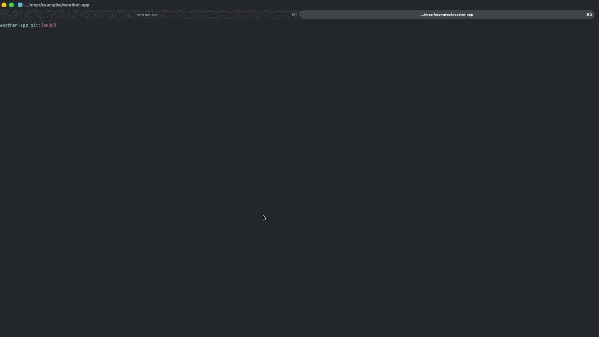

# mcpr

Open-source proxy for MCP Apps — fixes CSP, handles auth, observes every tool call.

```bash
curl -fsSL https://raw.githubusercontent.com/cptrodgers/mcpr/main/scripts/install.sh | sh
mcpr --mcp http://localhost:9000
```



## The Problem

MCP Apps (ChatGPT Apps, Claude connectors) run widgets inside sandboxed iframes. The sandbox blocks everything by default — API calls, images, fonts, scripts — unless you declare exactly the right CSP domains. Get it wrong and your widget silently doesn't render. No error. No hint. Just a blank iframe.

On top of that, your MCP server runs on one port, widgets on another, and AI clients need HTTPS. General proxies like ngrok don't understand MCP protocol, so you're left stitching together tunnels, headers, and CSP rules by hand.

mcpr fixes this. One binary. One command. Zero config.

## What It Does

**Fixes CSP automatically.** mcpr reads your MCP server's `_meta.ui.csp` declarations (`connectDomains`, `resourceDomains`, `frameDomains`) and injects the correct Content Security Policy headers. Your widgets render on the first try.

**Merges MCP + widgets behind one URL.** JSON-RPC requests route to your MCP server. Everything else serves your widgets. One origin, one tunnel, one URL to configure in ChatGPT or Claude.

**Observes every tool call.** Structured JSON events for every request — tool name, latency, session, status, CSP violations. Pipe to stdout, file, or [mcpr.app](https://cloud.mcpr.app) for dashboards and replay.

**Tunnels to production.** Public HTTPS URL in one command. Stable across restarts. No ngrok subscription. Works with ChatGPT, Claude, and any MCP client.

## Quickstart

### MCP server only

```bash
mcpr --mcp http://localhost:9000
# → https://abc123.tunnel.mcpr.app
```

### MCP server + widgets

```bash
mcpr --mcp http://localhost:9000 --widgets http://localhost:4444
# → https://abc123.tunnel.mcpr.app (one URL, two services)
```

### With structured events

```bash
mcpr --mcp http://localhost:9000 --events
```

Every MCP request emits a structured JSON event:

```json
{
  "ts": "2026-04-03T10:15:30.142Z",
  "type": "tool_call",
  "method": "tools/call",
  "tool": "search_products",
  "session": "sess_abc123",
  "latency_ms": 142,
  "status": "ok",
  "csp_applied": true
}
```

### Local only (no tunnel)

For Claude Desktop, VS Code, or Cursor — no public URL needed.

```bash
mcpr --mcp http://localhost:9000 --no-tunnel --port 3000
# → http://localhost:3000/mcp
```

## How It Works

```
Your machine                          AI client (ChatGPT / Claude)

┌─────────────────┐
│ MCP server :9000│◄──┐
└─────────────────┘   │
                      │    mcpr            tunnel
                      ├─────────────── ◄──────────── https://abc123.tunnel.mcpr.app
┌─────────────────┐   │   (CSP inject,
│ Widgets :4444   │◄──┘    events, auth)
└─────────────────┘
```

mcpr inspects every incoming request at the protocol level:

- **JSON-RPC** → routed to your MCP server (tool calls, discovery, sessions)
- **Everything else** → served as widget assets (HTML, JS, CSS, images)

Widget HTML is rewritten on the fly (`lol_html` streaming parser) so relative paths work correctly inside sandboxed iframes. CSP headers are injected based on your server's `_meta.ui.csp` metadata.

## Why Not Just Use ngrok?

| | mcpr | ngrok / Cloudflare Tunnel | Raw reverse proxy |
|---|---|---|---|
| Understands MCP protocol | ✓ | ✗ | ✗ |
| Auto-injects CSP headers | ✓ | ✗ | ✗ |
| Rewrites widget HTML for sandboxed iframes | ✓ | ✗ | ✗ |
| Merges MCP + widgets behind one URL | ✓ | ✗ | Manual config |
| Structured MCP events (tool calls, sessions) | ✓ | ✗ | ✗ |
| Public HTTPS tunnel | ✓ | ✓ | ✗ |
| Free | ✓ | Paid for stable URLs | ✓ |
| Zero config | ✓ | ✓ | ✗ |

## mcpr Studio

Test your MCP tools and preview widgets without an AI client subscription. Studio is available at [cloud.mcpr.app](https://cloud.mcpr.app):

- **Call tools** — execute MCP tools with custom input, see raw responses with timing
- **Preview widgets** — render widgets in ChatGPT and Claude simulation modes
- **Inspect CSP** — see which CSP rules are applied and what's being blocked
- **Test OAuth** — visualize and debug MCP OAuth flows end-to-end

## Configuration

mcpr works with zero config. For persistent settings, create `mcpr.toml`:

```toml
# mcpr.toml — minimal
mcp = "http://localhost:9000"
widgets = "http://localhost:4444"
```

```toml
# mcpr.toml — production
mcp = "http://localhost:9000"
widgets = "./widgets/dist"     # static files from disk
no_tunnel = true
port = 8080

[csp]
default = "default-src 'self'"

[logging]
format = "json"
level = "info"
```

CLI args override everything:

```
mcpr [OPTIONS]

Options:
  --version                Print version
  --mcp <URL>              Upstream MCP server
  --widgets <URL|PATH>     Widget source (dev server URL or static directory)
  --port <PORT>            Local proxy port (default: 8080)
  --events                 Emit structured JSON events to stdout
  --csp <DOMAIN>           Extra CSP domains (repeatable)
  --csp-mode <MODE>        CSP mode: "extend" (default) or "override"
  --no-tunnel              Local-only mode, no public URL
  --relay-url <URL>        Custom relay server
  --relay                  Run as relay server
  --relay-domain <DOMAIN>  Relay base domain (relay mode)
```

Config precedence: **CLI args > env vars > mcpr.toml > defaults**

See [`config_examples/`](config_examples/) for ready-to-use templates.

## Install

```bash
# Linux / macOS
curl -fsSL https://raw.githubusercontent.com/cptrodgers/mcpr/main/scripts/install.sh | sh

# Docker
docker run ghcr.io/cptrodgers/mcpr --mcp http://host.docker.internal:9000

# From source (Rust)
cargo install mcpr
```

### Docker Compose

```yaml
services:
  mcpr:
    image: ghcr.io/cptrodgers/mcpr:latest
    ports:
      - "8080:8080"
    command: ["--mcp", "http://mcp-server:9000", "--no-tunnel", "--port", "8080", "--events"]
```

## Self-Hosted Relay

Run your own tunnel relay instead of using `tunnel.mcpr.app`. Requires wildcard DNS and TLS termination.

See [docs/DEPLOY_RELAY_SERVER.md](docs/DEPLOY_RELAY_SERVER.md) for the full guide.

## Roadmap

mcpr is under active development. Here's what's shipping next:

- [x] MCP tunnel with stable URLs
- [x] Widget HTML rewriting + CSP injection
- [x] Structured event emitter (`--events`)
- [x] Protocol-level request classification (MCP vs widget)
- [x] Cloud Studio at mcpr.app
- [ ] Cloud event sync (one-line config)
- [ ] OAuth at the proxy layer via auth platforms (Supabase Auth, Better Auth, ...) or direct identity providers (Google, GitHub, ...)
- [ ] Tool-level ACL
- [ ] Production hardening (circuit breaker, retry, Redis sessions)
- [ ] Multi-server routing (one URL, many MCP backends)

See [ROADMAP.md](ROADMAP.md) for details and discussion.

## Architecture

mcpr is a Rust workspace with 7 crates:

| Crate | Purpose |
|-------|---------|
| `mcpr-cli` | Binary entry point, TUI, config |
| `mcpr-core` | Proxy engine, router, forwarding |
| `mcpr-protocol` | JSON-RPC parser, MCP types |
| `mcpr-widgets` | CSP handling, HTML rewriting |
| `mcpr-tunnel` | Tunnel client + self-hosted relay |
| `mcpr-events` | Structured event system |
| `mcpr-session` | Session management |

Single binary. No runtime dependencies. Built with Axum + Tower.

## Contributing

Contributions welcome.
Please open an issue to discuss before submitting PRs.

## License

Apache 2.0 — see [LICENSE](LICENSE) for details.
