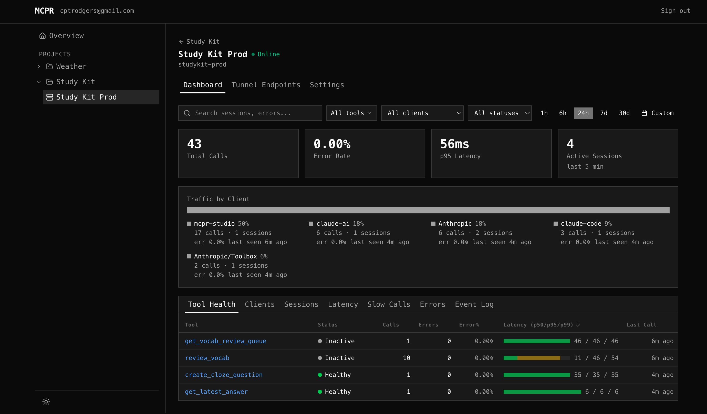

# mcpr

[](https://github.com/cptrodgers/mcpr/actions/workflows/check.yml)
[](https://codecov.io/gh/cptrodgers/mcpr)
[](LICENSE)

**The proxy for MCP servers.**
Route, log, and secure MCP traffic — from dev to production.

```bash
mcpr start --mcp http://localhost:9000/mcp --port 3000
```


---

## What It Does

mcpr sits between AI clients (ChatGPT, Claude, VS Code, Cursor) and your MCP server. It parses every JSON-RPC message at the protocol level — not as raw HTTP — so it can route, observe, and secure MCP traffic in ways generic proxies can't.

- **Route** — MCP-aware reverse proxy. Tool calls, resource reads, session handshakes — all parsed and forwarded correctly.
- **Observe** — Structured events for every request: tool name, latency, status, session ID. Pipe to stdout, or [mcpr.app](https://mcpr.app).
- **Handle CSP** — Rewrites CSP domain arrays in JSON-RPC metadata per platform (ChatGPT and Claude). Zero config.
- **Edge config** — Change CSP, OAuth URLs, and domain settings at the proxy. No server redeploy.

## Install

```bash
curl -fsSL https://mcpr.app/install.sh | sh
```

## Deploy Anywhere

Single Rust binary. No JVM, no Kubernetes, no database.

| Environment | How |
|---|---|
| **Local dev** | `mcpr start --mcp :9000` |
| **Dev + tunnel** | `mcpr start --mcp :9000 --tunnel` |
| **VPS / VM** | `mcpr start --mcp :9000` |
| **Docker** | `docker run -p 3000:3000 -p 9901:9901 -v ./mcpr.toml:/app/mcpr.toml ghcr.io/cptrodgers/mcpr:latest` |
| **Kubernetes** | Helm chart (coming soon) |

> `mcpr start` runs as a background daemon. Use `mcpr start --foreground` for Docker/systemd.

## Observability

Every MCP request is recorded to a local SQLite store. Query anytime:

```bash
mcpr proxy logs               # recent request log
mcpr proxy stats              # per-tool metrics (calls, avg, p95, errors)
mcpr proxy slow --threshold 1s  # find slow calls
mcpr proxy clients            # who's calling?
```

Stream to [mcpr.app](https://mcpr.app) for a full cloud dashboard:

```toml
[cloud]
token = "mcpr_xxxxxxxx"
server = "my-server"          # matches server name in your mcpr.app project
# endpoint = "https://api.mcpr.app"  # optional, default
# batch_size = 100                    # optional, events per batch
# flush_interval_ms = 5000           # optional, flush interval
```

### mcpr.app Dashboard

The cloud dashboard gives you:

- **Tool Health** — per-tool status (healthy/degraded/down), error rate, p50/p95/p99 latency, sortable table
- **Client Breakdown** — traffic by AI client (ChatGPT, Claude, VS Code, Cursor), detected from MCP `initialize` handshake
- **Sessions** — per-session timeline with expandable event detail, active/ended status
- **Latency Charts** — overall percentile timeline + per-tool line chart with p50/p95/p99 toggle
- **Slow Calls** — outlier detection with "vs p50" multiplier, request/response sizes
- **Error Grouping** — errors grouped by tool + message with timeline, first/last seen
- **Event Log** — live streaming log with search, filters, export
- **Global Filters** — filter by tools (multi-select), client, status, and custom time ranges

<!-- SCREENSHOT: replace with actual dashboard screenshot -->


Answer questions like:
- "Which tool is slow?" — sort by p95, see the latency bar
- "Is it my server or the client?" — filter by ChatGPT vs Claude vs VS Code
- "What happened in this user's session?" — click a session ID, see every event in order
- "When did errors start?" — error timeline shows exactly when and which tools broke

## CSP Handling

MCP Apps (ChatGPT Apps, Claude connectors) render widgets in sandboxed iframes with strict CSP. Every platform enforces it differently. mcpr handles this automatically:

- Rewrites CSP domain arrays in JSON-RPC response metadata (`tools/list`, `tools/call`, `resources/list`, `resources/read`)
- Replaces localhost/upstream URLs with the proxy (tunnel) domain
- Adds extra domains from config to `connectDomains` and `resourceDomains`
- Adapts format per platform (ChatGPT uses `openai/widgetCSP`, Claude uses `ui.csp`)
- Deep-scans the entire response to catch CSP arrays in nested structures
- Supports two modes: **extend** (keep external domains, strip localhost) or **override** (only configured domains)

Zero config in extend mode. Works on first proxy.

## Health & Admin

mcpr runs an admin API on port `9901` (configurable via `--admin-bind`):

| Endpoint | Purpose |
|---|---|
| `GET /healthz` | Liveness — 200 unless shutting down |
| `GET /ready` | Readiness — 503 while draining or MCP upstream disconnected |
| `GET /version` | Version info as JSON |

Kubernetes probes:
```yaml
livenessProbe:
  httpGet: { path: /healthz, port: 9901 }
readinessProbe:
  httpGet: { path: /ready, port: 9901 }
```

## CLI

mcpr runs as a background daemon. Start it, observe it, stop it.

```
mcpr start                     Start proxy daemon (default)
mcpr start --foreground        Start in foreground (Docker/systemd)
mcpr stop                      Stop the daemon
mcpr restart                   Restart the daemon
mcpr status                    Show PID, port, uptime, proxy name

mcpr proxy logs [name]         Request logs (--follow, --json, --tool, --status)
mcpr proxy slow [name]         Slow calls above threshold
mcpr proxy stats [name]        Per-tool metrics (calls, avg, p95, errors)
mcpr proxy status [name]       Proxy overview (requests, errors, active sessions)
mcpr proxy sessions [name]     MCP sessions with client info
mcpr proxy session <id>        Drill into a session (metadata + all requests)
mcpr proxy clients [name]      AI client breakdown

mcpr store stats               Database size and row counts
mcpr store vacuum --before 7d  Delete old records, reclaim disk

mcpr validate                  Validate mcpr.toml
mcpr version                   Print version as JSON
```

`[name]` is optional when one proxy is running — auto-detected from the daemon.

See [docs/CLI.md](docs/CLI.md) for full reference with all flags and examples.

## Getting Started

### Proxy an MCP server

```bash
mcpr start --mcp http://localhost:9000 --port 3000 # → mcpr daemon started (PID: 12345, port: 3000)

mcpr status
# → mcpr daemon is running
#     Proxy: localhost-9000   PID: 12345   Port: 3000

mcpr proxy logs
# → recent request log

mcpr stop
```

### Use a config file

```toml
# mcpr.toml
mcp = "http://localhost:9000"
port = 3000
widgets = "http://localhost:4444"

[csp]
domains = ["api.stripe.com", "cdn.example.com"]
```

```bash
mcpr start
```

### Observe traffic

```bash
mcpr proxy stats              # per-tool metrics
mcpr proxy slow --threshold 1s  # find slow calls
mcpr proxy logs --follow      # live tail
mcpr proxy clients            # who's calling?
```

## Roadmap

- [x] MCP proxy (route JSON-RPC to upstream)
- [x] Widget proxy (merge MCP + widget assets)
- [x] CSP auto-detection and enrichment
- [x] Platform adaptation (ChatGPT / Claude / VS Code)
- [x] Edge config (CSP, domains, OAuth URLs)
- [x] Structured event emission (cloud sync)
- [x] TUI dashboard
- [x] Cloud dashboard ([mcpr.app](https://mcpr.app))
- [x] Cloud sync
- [x] Per-tool health (calls, errors, p50/p95)
- [x] Admin API with health endpoints (`/healthz`, `/ready`)
- [x] SIGTERM graceful drain for Kubernetes
- [x] Structured stderr logging (JSON/pretty)
- [x] Daemon mode (`mcpr start/stop/restart/status`)
- [x] SQLite request storage engine
- [x] CLI observability (`mcpr proxy logs/slow/stats/sessions/clients`)
- [x] Storage maintenance (`mcpr store stats/vacuum`)
- [ ] `mcpr proxy view` — TUI viewer that attaches to running daemon
- [ ] Multiple proxies in one daemon (`[[proxy]]` config array)
- [ ] Prometheus metrics (`/metrics`)
- [ ] SIGHUP config reload
- [ ] OAuth 2.1 at the proxy
- [ ] ACL (per-tool access control)
- [ ] Multi-server routing
- [ ] Rate limiting + circuit breaker
- [ ] Widget injection (add widgets to tool-only servers)
- [ ] OTLP ingestion

## Also Includes

A built-in tunnel for development — public HTTPS URL with zero setup, no ngrok needed. And [mcpr.app](https://mcpr.app) Studio for testing MCP servers in the browser.

## License

Apache 2.0
