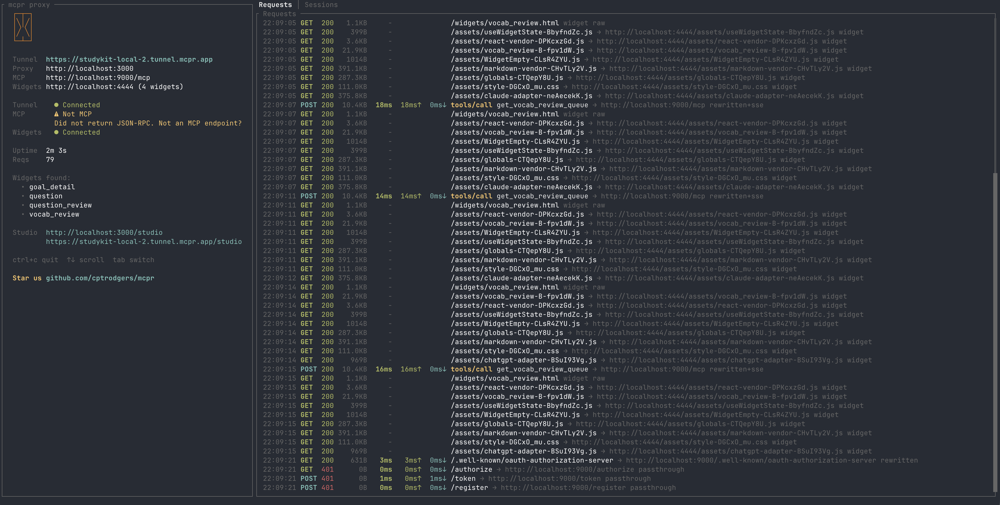
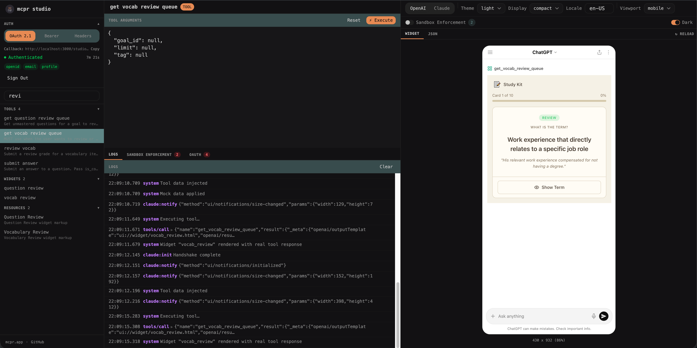
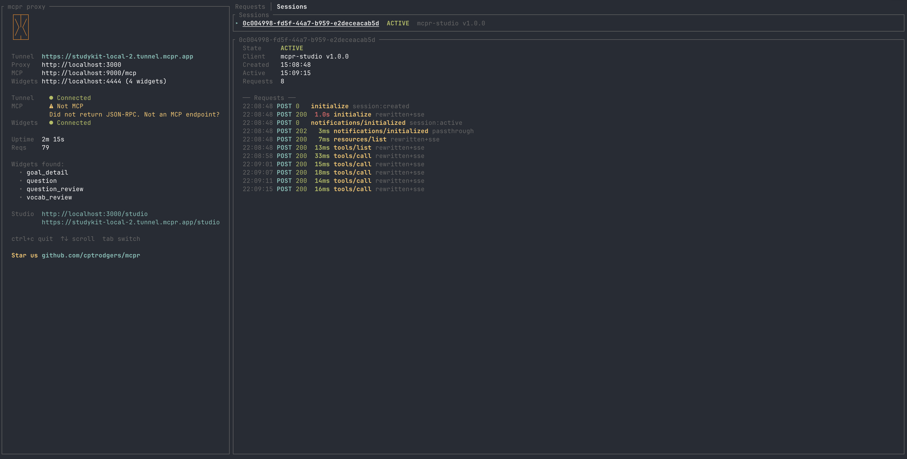

<p align="center">
  
</p>

<h1 align="center">mcpr</h1>

**Nginx handles HTTP. mcpr handles MCP.**

MCP-aware proxy for ChatGPT Apps and Claude connectors.
Tunnel, test, and ship — one command, one endpoint.


https://github.com/user-attachments/assets/680c8b9c-8ffb-4cfb-b175-bdaf5c6f49b4


## Install

```bash
curl -fsSL https://raw.githubusercontent.com/cptrodgers/mcpr/main/scripts/install.sh | sh
```

## Features

### MCP Tunnel

Expose your local MCP server to ChatGPT, Claude, or any AI client — one command, public HTTPS.

```bash
mcpr --mcp http://localhost:9000
# → https://abc123.tunnel.mcpr.app
```

Running widgets server/static assets too? mcpr merges both services behind a single URL. `/mcp` routes to your backend, everything else serves your widgets.

```bash
mcpr --mcp http://localhost:9000 --widgets http://localhost:4444
# → https://abc123.tunnel.mcpr.app       (one URL, two services)
```

```
Your machine                           AI client (ChatGPT / Claude)
┌─────────────────┐
│ MCP server      │◄──┐
│ :9000           │   │
└─────────────────┘   │    mcpr         tunnel
                      ├──────────── ◄──────────── https://abc123.tunnel.mcpr.app
┌─────────────────┐   │
│ Widgets         │◄──┘
│ :4444           │
└─────────────────┘
```

The URL stays the same across restarts — configure your AI client once, keep developing.



### mcpr Studio

Test your MCP tools and preview widgets locally — no AI model, no API key, no subscription.

Without Studio, the only way to test widgets is deploying to a public URL and opening them inside ChatGPT or Claude. That means waiting for deployments, burning API credits, and debugging through layers of indirection. Studio gives you the same sandboxed environment locally.

- **Call tools** — execute your MCP tools with custom input and see raw responses
- **Render & interact with widgets** — preview the returned UI in a sandboxed iframe, just like ChatGPT and Claude do in production
- **Full widget API simulation** — `window.openai` (ChatGPT) and JSON-RPC 2.0 (Claude) widget APIs are fully mocked, including `callTool`, `sendFollowUpMessage`, `openExternal`, resize, display modes, and more
- **CSP & sandbox enforcement** — Studio applies production-equivalent Content Security Policy and sandbox restrictions, catching violations before you deploy
- **Inspect actions** — trace every postMessage your widget fires back to the host
- **Switch platforms** — toggle between OpenAI and Claude simulation modes to verify your widget works on both
- **OAuth debugger** — visualize and debug MCP OAuth flows without leaving Studio
- **Viewport testing** — preview on mobile (430×932), tablet (820×1180), desktop (1280×800), or custom sizes



### Protocol-Aware Debugging

mcpr understands MCP at the protocol level — not just HTTP.

Every request is parsed as JSON-RPC 2.0, classified by MCP method, and logged with full context: which tool was called, how long the upstream took, how much overhead the proxy added, and whether the response contained an error.

```
 21:23:11 POST 200  8.0KB  16ms  15ms↑  1ms↓ initialize → http://localhost:9000/mcp
 21:23:11 POST 200 73.6KB  11ms   7ms↑  4ms↓ tools/list → http://localhost:9000/mcp
 21:23:11 POST 200   147B   8ms   8ms↑  0ms↓ tools/call get_weather → http://localhost:9000/mcp
 21:23:11 POST 200   637B   4ms   4ms↑  0ms↓ resources/read ui://widget/clock.html
 21:23:11 POST 200   147B   8ms   8ms↑  0ms↓ tools/call search [-32602 Invalid params] → ...
```

- **MCP method detection** — `initialize`, `tools/call`, `resources/read`, `prompts/get`, etc.
- **Tool & resource names** — see which tool was called or which resource was read
- **Timing breakdown** — total round-trip, upstream server time (↑), proxy overhead (↓)
- **JSON-RPC errors** — error codes and messages from the MCP server shown inline
- **Session tracking** — track MCP sessions with client info, state, and request history



### Edge Config

Like Nginx or Caddy for your MCP app — move environment-specific config out of your application and into the proxy layer.

AI clients require CSP headers, widget domains, and OAuth URLs tailored to each environment. Instead of hardcoding these in your MCP server, mcpr rewrites them at the edge — automatically, for both OpenAI and Claude formats.

- **CSP headers** — inject or extend Content Security Policy per environment
- **Widget & OAuth domains** — rewrite URLs so your server stays environment-agnostic
- **Zero redeploy** — change config at the proxy, not in your application

## Comparison

| | ngrok | Cloudflare Tunnel | MCPJam Inspector | mcpr |
|---|---|---|---|---|
| **MCP protocol awareness** | None — treats MCP as opaque HTTP | None | Yes — full JSON-RPC inspection | Full JSON-RPC 2.0 parsing — method classification, tool names, error codes, session tracking, timing breakdown |
| **Multi-service behind one URL** | Separate URLs per service. Path routing needs paid plan. | Possible with Workers config | No — inspector only, not a proxy | Auto-detects MCP requests vs widget requests, merges behind one URL |
| **Tunnel to public HTTPS** | Yes | Yes | No | Yes, one command |
| **Widget testing** | No | No | Yes — emulates ChatGPT & Claude widget APIs | Yes — Studio emulates both platforms with CSP enforcement |
| **Widget HTML rewriting** | No | No | No — not a proxy | Rewrites relative paths so widgets work in sandboxed iframes |
| **CSP for MCP Apps** | Manual Traffic Policy | Manual Workers | CSP testing in inspector | Built-in per-environment CSP injection at the proxy layer |
| **OAuth debugging** | No | No | Yes — visual OAuth flow debugger | Yes — built-in OAuth debugger in Studio |
| **LLM playground** | No | No | Yes — test against GPT-5, Claude, Gemini | No |
| **Price** | Free tier for single endpoint; paid for path routing | Free | Free, open source | Free, open source |

> **When ngrok is fine:** ngrok works well if you have a simple MCP server with no widgets (tool-only), bundled single-HTML widgets served inline, or you already have ngrok's paid plan with Traffic Policy.
>
> **When MCPJam is great:** MCPJam Inspector is an excellent standalone testing client. If you only need to inspect and test your MCP server without tunneling or proxying, it's a great choice. mcpr focuses on the proxy/tunnel side — they complement each other.

## Getting Started

mcpr looks for `mcpr.toml` in the current directory (then parent dirs). CLI args override config values.

### MCP server only

Tunnel your MCP server — no widgets.

```toml
# mcpr.toml
mcp = "http://localhost:9000"
```

```bash
mcpr
# → https://abc123.tunnel.mcpr.app
```

### MCP server + widgets

Merge both services behind one URL.

```toml
# mcpr.toml
mcp = "http://localhost:9000"
widgets = "http://localhost:4444"
```

```bash
mcpr
# → https://abc123.tunnel.mcpr.app
```

On first run, mcpr generates a stable tunnel token and saves it to `mcpr.toml`. The URL stays the same across restarts.

### Local only (no tunnel)

For local clients like Claude Desktop, VS Code, or Cursor — no public URL needed.

```toml
# mcpr.toml
mcp = "http://localhost:9000"
no_tunnel = true
port = 3000
```

```bash
mcpr
# → http://localhost:3000/mcp
```

### Static widgets

Serve pre-built widgets from disk instead of proxying a dev server.

```toml
# mcpr.toml
mcp = "http://localhost:9000"
widgets = "./widgets/dist"
```

### Self-hosted relay

Run your own tunnel relay instead of using `tunnel.mcpr.app`. This requires wildcard DNS, TLS termination (e.g. Cloudflare Tunnel, Caddy, or nginx + Let's Encrypt), and careful configuration.

See [docs/DEPLOY_RELAY_SERVER.md](docs/DEPLOY_RELAY_SERVER.md) for the full guide before getting started.

The relay supports three auth modes -- open (anyone can tunnel), static tokens (hardcoded in config), or external auth provider (for dynamic token management). See [docs/AUTH_PROVIDER.md](docs/AUTH_PROVIDER.md) for details on building an auth provider.

## CLI

```
mcpr [OPTIONS]

Gateway mode (default):
  --mcp <URL>                     Upstream MCP server
  --widgets <URL|PATH>            Widget source (URL = proxy, PATH = static serve)
  --port <PORT>                   Local proxy port
  --csp <DOMAIN>                  Extra CSP domains (repeatable)
  --csp-mode <MODE>               CSP mode: "extend" (default) or "override"
  --relay-url <URL>               Custom relay server (env: MCPR_RELAY_URL)
  --no-tunnel                     Local-only, no tunnel

Relay mode:
  --relay                         Run as relay server
  --relay-domain <DOMAIN>         Relay base domain (required in relay mode)
  --auth-provider <URL>           Auth provider URL (env: MCPR_AUTH_PROVIDER)
  --auth-provider-secret <SECRET> Shared secret (env: MCPR_AUTH_PROVIDER_SECRET)
```

Config priority: **CLI args > environment variables > mcpr.toml > defaults**

See [`config_examples/`](config_examples/) for ready-to-use templates and [docs/CONFIGURATION.md](docs/CONFIGURATION.md) for the full reference.

## Contributing

Contributions are welcome! Please open an issue or submit a pull request.

## License

Apache 2.0 — see [LICENSE](LICENSE) for details.
