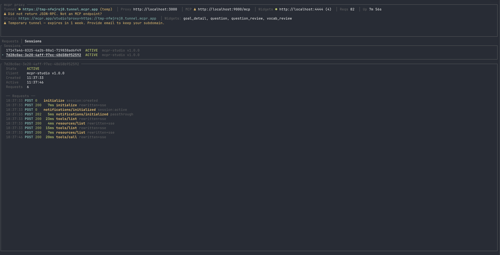
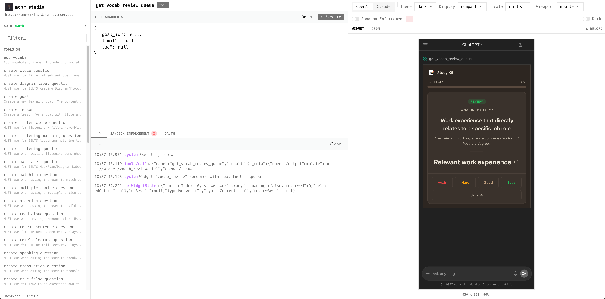

<p align="center">
  
</p>

<h1 align="center">mcpr</h1>

**Proxy, debug, and observe your MCP server.**

Building an MCP server? ChatGPT and Claude need a public HTTPS endpoint with correct CSP headers — but your server is on localhost, your widgets break in sandboxed iframes, and you can't see what the AI client is actually sending you.

mcpr sits between your MCP server and the AI client. One command gives you a public tunnel, rewrites CSP so widgets just work, and logs every JSON-RPC call so you can see exactly what's happening.

```bash
curl -fsSL https://raw.githubusercontent.com/cptrodgers/mcpr/main/scripts/install.sh | sh
mcpr --mcp http://localhost:9000
# → https://abc123.tunnel.mcpr.app
```


https://github.com/user-attachments/assets/680c8b9c-8ffb-4cfb-b175-bdaf5c6f49b4


## Install

```bash
curl -fsSL https://raw.githubusercontent.com/cptrodgers/mcpr/main/scripts/install.sh | sh
```

## Proxy and Tunnel

Point mcpr at your MCP server. You get a public HTTPS URL, a TUI that shows every tool call, and CSP handled for you.

```bash
mcpr --mcp http://localhost:9000
# → https://abc123.tunnel.mcpr.app
```

Serving widgets too? Add `--widgets` — mcpr merges both behind one URL.

```bash
mcpr --mcp http://localhost:9000 --widgets http://localhost:4444
```

```
Your machine                           AI client (ChatGPT / Claude)
┌─────────────────┐
│ MCP server      │◄──┐
└─────────────────┘   │    mcpr         tunnel
                      ├──────────── ◄──────────── https://abc123.tunnel.mcpr.app
┌─────────────────┐   │
│ Widgets         │◄──┘
└─────────────────┘
```

The URL stays the same across restarts. Configure your AI client once, keep developing.

Every request is parsed as JSON-RPC 2.0 — you see methods, tool names, errors, and timing in the TUI:

```
 21:23:11 POST 200  8.0KB  16ms  15ms↑  1ms↓ initialize → http://localhost:9000/mcp
 21:23:11 POST 200   147B   8ms   8ms↑  0ms↓ tools/call get_weather → http://localhost:9000/mcp
 21:23:11 POST 200   147B   8ms   8ms↑  0ms↓ tools/call search [-32602 Invalid params] → ...
```



Need machine-readable output? Pipe structured events to any log aggregator:

```bash
mcpr --mcp http://localhost:9000 --events 2>/dev/null | jq
```

```json
{"ts":"...","type":"tool_call","tool":"search_products","latency_ms":142,"status":"ok"}
```

CSP, widget domains, and OAuth URLs are rewritten at the proxy layer — your MCP server stays environment-agnostic. See [docs/CONFIGURATION.md](docs/CONFIGURATION.md) for details.

### mcpr Studio

Test tools and preview widgets at [mcpr.app/studio](https://mcpr.app/studio) — call tools, render widgets in a sandboxed iframe, debug OAuth flows, toggle between OpenAI and Claude modes.

```
https://mcpr.app/studio?proxy=https://abc123.tunnel.mcpr.app
```



## Comparison

| | ngrok | Cloudflare Tunnel | MCPJam Inspector | mcpr |
|---|---|---|---|---|
| **MCP protocol awareness** | None | None | Yes — JSON-RPC inspection | Full JSON-RPC 2.0 parsing, method classification, timing breakdown |
| **Multi-service behind one URL** | Separate URLs per service | Possible with Workers config | No — inspector only | Auto-merges MCP + widgets behind one URL |
| **Tunnel to public HTTPS** | Yes | Yes | No | Yes, one command |
| **Widget testing** | No | No | Yes — emulates ChatGPT & Claude widget APIs | Yes — Cloud Studio at mcpr.app with CSP enforcement |
| **OAuth debugging** | No | No | Yes — visual OAuth flow debugger | Yes — OAuth debugger in Cloud Studio |
| **CSP for MCP Apps** | Manual | Manual | CSP testing in inspector | Built-in per-environment CSP injection |
| **LLM playground** | No | No | Yes — test against GPT-5, Claude, Gemini | No |
| **Price** | Free tier; paid for path routing | Free | Free, open source | Free, open source |

## Getting Started

mcpr looks for `mcpr.toml` in the current directory (then parent dirs). CLI args override config values.

### MCP server only

```toml
# mcpr.toml
mcp = "http://localhost:9000"
```

```bash
mcpr
# → https://abc123.tunnel.mcpr.app
```

### MCP server + widgets

```toml
# mcpr.toml
mcp = "http://localhost:9000"
widgets = "http://localhost:4444"
```

```bash
mcpr
# → https://abc123.tunnel.mcpr.app
```

On first run, mcpr generates a stable tunnel token and saves it to `mcpr.toml`. The URL stays the same across restarts.

### Local only (no tunnel)

For local clients like Claude Desktop, VS Code, or Cursor — no public URL needed.

```toml
# mcpr.toml
mcp = "http://localhost:9000"
no_tunnel = true
port = 3000
```

```bash
mcpr
# → http://localhost:3000/mcp
```

### Static widgets

Serve pre-built widgets from disk instead of proxying a dev server.

```toml
# mcpr.toml
mcp = "http://localhost:9000"
widgets = "./widgets/dist"
```

### Structured events via config

```toml
# mcpr.toml
mcp = "http://localhost:9000"

[events]
enabled = true
```

### Self-hosted relay

Run your own tunnel relay instead of using `tunnel.mcpr.app`. Requires wildcard DNS and TLS termination.

See [docs/DEPLOY_RELAY_SERVER.md](docs/DEPLOY_RELAY_SERVER.md) for the full guide.

The relay supports three auth modes — open, static tokens, or external auth provider. See [docs/AUTH_PROVIDER.md](docs/AUTH_PROVIDER.md) for details.

## CLI

```
mcpr [OPTIONS]

Gateway mode (default):
  --mcp <URL>              Upstream MCP server
  --widgets <URL|PATH>     Widget source (URL = proxy, PATH = static serve)
  --port <PORT>            Local proxy port
  --csp <DOMAIN>           Extra CSP domains (repeatable)
  --csp-mode <MODE>        CSP mode: "extend" (default) or "override"
  --relay-url <URL>        Custom relay server (env: MCPR_RELAY_URL)
  --no-tunnel              Local-only, no tunnel
  --events                 Emit structured JSON events to stdout

Relay mode:
  --relay                  Run as relay server
  --relay-domain <DOMAIN>  Relay base domain (required in relay mode)
  --auth-provider <URL>    Auth provider URL (env: MCPR_AUTH_PROVIDER)
  --auth-provider-secret <SECRET> Shared secret (env: MCPR_AUTH_PROVIDER_SECRET)
```

Config priority: **CLI args > environment variables > mcpr.toml > defaults**

See [`config_examples/`](config_examples/) for ready-to-use templates and [docs/CONFIGURATION.md](docs/CONFIGURATION.md) for the full reference.

## Contributing

Contributions are welcome! Please open an issue or submit a pull request.

## License

Apache 2.0 — see [LICENSE](LICENSE) for details.
