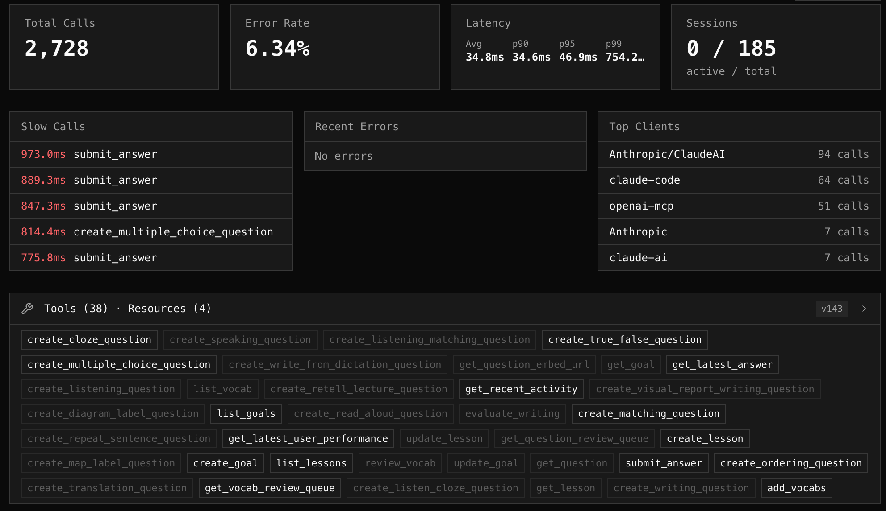

<div align="center">


# mcpr

[](https://github.com/pragmalabs-tech/mcpr/actions/workflows/check.yml)
[](https://codecov.io/gh/pragmalabs-tech/mcpr)
[](LICENSE)

**Observability-first proxy for MCP servers.** Per-tool metrics, session capture, and schema tracking in a single Rust binary — with [~1ms p99](benches/reports/v0.4.42-post-refactor.md) overhead. Sits in front of your MCP app and records every JSON-RPC call to a local SQLite store.


</div>

## Quickstart

Install and run:

```bash
# Install
curl -fsSL https://mcpr.app/install.sh | sh

# Onboarding - help you to setup
mcpr proxy setup
```

Docker is in beta — see [docs/DOCKER.md](docs/DOCKER.md) for volumes, health probes, and compose/Kubernetes examples.

---

## What mcpr does

mcpr sits in front of your MCP app and does three things, in order of how much work each one saves you:

1. **Observe**: records every `tools/call`, `resources/*`, and `prompts/*` request to a local SQLite store. Per-tool p50/p95/max latency, error rates, session traces, client breakdowns, and schema diffs over time. No instrumentation in your app.
2. **Route**: one upstream per proxy today. JSON-RPC classification, and CSP rewriting that emits the shape each AI client (ChatGPT, Claude, Copilot) expects.
3. **Authenticate** *(in progress)*: OAuth 2.1 and API key handling at the proxy layer. Your app receives a verified `x-user-id` header instead of implementing auth flows itself.

Running in front of [mcp.usestudykit.com/mcp](https://mcp.usestudykit.com/mcp) today.

---

## Observe

mcpr capture all mcp request — tool name, latency, status, error code, request/response size, session ID. All `mcpr proxy` commands read from this store and work whether or not the daemon is running. Use `mcpr proxy help` to see all observe supporting commands.

### Per-tool metrics

```bash
$ mcpr proxy status
STATUS — localhost-9000 — last 1h

  Total requests:    1,284
  Error rate:        2.3%
  Sessions:          12 total   3 active

  TOOL                  CALLS      AVG      P95      MAX   ERRORS   BYTES IN  BYTES OUT
  get_weather             412    45ms    120ms    340ms      0%     48.2 KB    196.8 KB
  search_docs             389    82ms    210ms    890ms     1.5%    92.1 KB    1.2 MB
  run_query               156   240ms    890ms   2.40s      8.3%   128.4 KB    2.8 MB
```

### Request logs

```bash
mcpr proxy logs --tool search_docs --status error    # failed calls to search_docs
mcpr proxy logs --follow                             # live tail (polls every 500ms)
mcpr proxy logs --session abc123                     # filter by session (prefix match)
mcpr proxy logs --method tools/call                  # filter by MCP method
mcpr proxy logs --since 30m --tail 100               # last 30 minutes, 100 rows
```

### Slow calls

```bash
$ mcpr proxy slow --threshold 500ms
  TOOL              LATENCY    TIME                   STATUS
  run_query          2.40s     2025-04-10 14:20:12    ok
  run_query          1.80s     2025-04-10 14:18:45    ok
  search_docs         890ms    2025-04-10 14:15:33    error
```

### Schema capture

mcpr intercepts `tools/list`, `resources/list`, and `prompts/list` responses as they pass through. It stores the server's schema and records each change.

```bash
$ mcpr proxy schema
Server: my-mcp-server v1.2.0 (MCP 2025-03-26)
Capabilities: tools, resources
Schema: complete
Last captured: 2026-04-12 14:30:00

── tools/list ──
  Tools (3):
    search_products  —  Search the product catalog by keyword
    get_product      —  Get product details by ID
    create_order     —  Create a new order
```

```bash
$ mcpr proxy schema --changes
  TIME                  METHOD        CHANGE           ITEM
  2026-04-12 14:30:00   tools/list    tool_added       send_email
  2026-04-10 09:15:00   tools/list    tool_modified    search_products
```

`mcpr proxy schema --unused` compares listed tools against actual call logs to find tools that are registered but never called.

### Sessions and clients

```bash
$ mcpr proxy sessions
  SESSION    CLIENT                 STARTED         CALLS   ERRS
  a1b2c3d4   claude-desktop 1.2.0   Apr 10 14:20      45      2
  e5f6g7h8   cursor 0.48.0          Apr 10 14:15      23      0

$ mcpr proxy clients
  CLIENT              VERSION    PLATFORM   SESSIONS    CALLS   ERRORS
  claude-desktop      1.2.0      claude           12    4,201        8
  cursor              0.44.1     cursor            3      891        0
```

---

## Route

Each proxy instance fronts one upstream MCP app. mcpr classifies requests by JSON-RPC shape: MCP methods go to the backend; anything else is forwarded upstream as-is.

```toml
mcp = "http://localhost:9000"
```

To proxy multiple MCP servers, write one `mcpr.toml` per upstream and launch each with `mcpr proxy run --config <path>`.

### Widget CSP

mcpr applies widget CSP in both shapes — the legacy OpenAI per-widget format and the current MCP standard — so a single config block works for both Claude and ChatGPT.

```toml
[csp]
# Public host the proxy is reachable on — written into the OpenAI
# `widgetDomain` field. `_meta.ui.domain` is left to Claude, which
# derives that field from the proxy URL itself and rejects values
# supplied by anything in front of it.
domain = "widgets.example.com"

# Lands in `connect-src` — fetch / WebSocket / EventSource targets.
# `extend` merges with whatever the upstream MCP server declared;
# `replace` ignores upstream.
[csp.connectDomains]
domains = ["api.example.com"]
mode    = "extend"

# Lands in `script-src`, `style-src`, `img-src`, `font-src`, `media-src`
# — one bucket for everything the widget loads. Same merge semantics.
[csp.resourceDomains]
domains = ["cdn.example.com"]
mode    = "extend"

# Lands in `frame-src` — nested iframes. Defaults to `replace` so
# upstream cannot silently widen this directive.
[csp.frameDomains]
domains = []
mode    = "replace"

# Per-widget override, matched by URI pattern (glob). Only the
# payment widget gets `connect-src` to Stripe.
[[csp.widget]]
match              = "ui://widget/payment*"
connectDomains     = ["api.stripe.com"]
connectDomainsMode = "extend"
```

---

## Authenticate

*In progress.* mcpr will handle MCP OAuth 2.1 and API key auth at the proxy layer, so your MCP app receives a verified `x-user-id` header instead of implementing auth flows itself. Planned config:

```toml
[auth]
mode = "oauth2.1"           # or "api_key"
provider = "google"         # google, github, bring-your-own
```

Track progress in the [Auth roadmap](#roadmap) below. Open an issue if your provider isn't covered.

---

## mcpr cloud dashboard (Optional)

For a shared web UI instead of CLI access, [cloud.mcpr.app](https://cloud.mcpr.app) ingests events from your proxies — metadata only (tool name, latency, status, sizes). We don't sync request and response bodies.

Data flows one way: proxy → cloud, pushed via a project token from `mcpr proxy setup`. Your local SQLite remains the source of truth.



---

## Reference

- Configuration — [docs/proxy/PROXY_CONFIGURATION.md](docs/proxy/PROXY_CONFIGURATION.md) (upstream URL, port, tunnel, CSP, cloud sync, logging, limits)
- CLI — [docs/CLI.md](docs/CLI.md) (proxies, relay, and SQLite queries)
- Docker — [docs/DOCKER.md](docs/DOCKER.md) (volumes, health probes, compose/Kubernetes)

---

## Roadmap

**Observability**
- [x] Per-tool metrics (calls, error%, p50, p95, max, request/response size)
- [x] Request logs, session tracking, AI client tracking
- [x] Schema capture with change tracking
- [x] Cloud dashboard sync ([cloud.mcpr.app](https://cloud.mcpr.app))

**Routing & Network**
- [x] JSON-RPC routing (single upstream per proxy)
- [x] CSP rewriting
- [ ] Multi-upstream routing from one port

**Auth**
- [ ] OAuth 2.1 for standard providers
- [ ] OAuth 2.1 for legacy (non-standard) auth
- [ ] API token auth
- [ ] Multiple auth modes per server

**Security**
- [ ] Per-tool access control
- [ ] Rate limiting and circuit breaker
- [ ] IP whitelist

**Tunnel/Relay**
- [x] Built-in tunnel client and self-hosted relay server
- [x] Standalone `mcpr relay` CLI with daemon lifecycle
- [x] Graceful shutdown

## License

Apache 2.0
